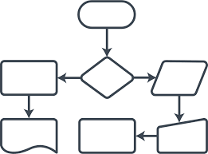

#  SCOREKEEPER

#### PLANTEAMIENTO:

###### Imagina que estás jugando un juego con algunas amigas y quieres ir registrando el puntaje de cada una. Crea un object llamado scores donde los keys o propiedades son los nombres de tus amigas, y los valores serán los puntajes (todos empiezan con 0).

###### Escribe una función que toma dos argumentos, el nombre de tu amiga y la cantidad de puntos nuevos que ha obtenido, y que actualice los puntos de la jugadora en el object scores. También escribe una función que imprima en la consola el total de los puntos.

#### PSEUDOCODIGO :
##### Descripcion.
###### En esta parte se decribe la funcionalidad del proyecto descrito en pasos.

1.- Definir el objeto SCORES donde se almacenara toda la data.

2.- Crear los elementos JUGADORES que se almacenaran como *keys* en el objeto.

3.- Agregar el puntaje de cada jugador.

4.- Imprimir toda la data que se enncuentra almacenada de _SCORES_

#### DIAGRAMA DE FLUJO :
##### Descripcion.
###### Flujo a seguir de nuestro programa

